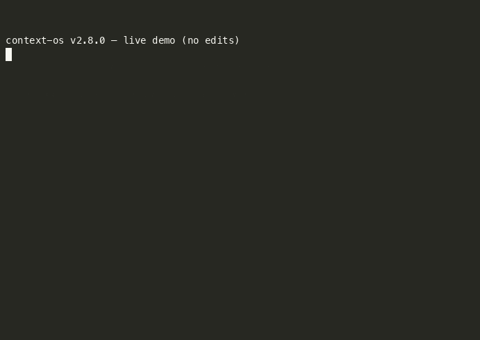

# context-os

[](https://github.com/sravan27/context-os/actions/workflows/ci.yml)
[](LICENSE)
[](https://github.com/sravan27/context-os/releases/tag/v2.8.0)

**Cut Claude Code token usage by 40.9%.** A 400-line Python hook that builds a static graph of your repo (symbols + imports + git-hot files) and injects ranked `file:line` candidates into the prompt before Claude sees it. So the first turn opens the right file instead of grepping for it.

No embeddings. No server. No model call. ~50 ms.

```bash
curl -fsSL https://raw.githubusercontent.com/sravan27/context-os/main/setup.sh | bash
```



*60-second demo: graph stats → autocontext block with import counts → cross-repo eval (auto_context 0.545 winning) → 9/9 CI floors PASS. Reproduce with `bash docs/distribution/demo.sh`.*

## Private repo audit

If your team is already spending heavily on Claude Code, Codex, Cursor, or other coding agents and wants a private cost-leak report, I am doing a small number of 48-hour audits this week: [AI Agent Cost Leak Audit](https://sravan27.github.io/money-27-proof/agent-cost-leak-audit.html).

The open-source hook stays MIT and free. The paid audit is for teams that want the same measurement discipline applied to their own repo, prompts, and agent workflows.

Quick local preview:

```bash
python3 python/agent_cost_leak_check.py --repo . --json
```

## The number

Live A/B on 36 real `claude --print` calls, identical fixture, identical model, only difference is whether the hook is active:

| Metric                           |        Value |
| -------------------------------- | -----------: |
| Aggregate tokens                 |   **−40.9%** |
| Prompt-level wins                |      **6/6** |
| Bootstrap 95% CI                 |  32.7%–48.9% |
| Paired t-test                    |   p = 5.1e-7 |
| Wall-clock                       |       −35.3% |

Raw JSON for every call: [`python/evals/reports/live-session-bench-raw.json`](python/evals/reports/live-session-bench-raw.json) · methodology: [`docs/METHODOLOGY.md`](docs/METHODOLOGY.md).

Cross-repo: 36 hand-labeled prompts × 3 unseen OSS repos (axios, ripgrep, requests). Weighted MRR **0.545 vs 0.461** best lexical baseline — **+18.2%**. Beats every baseline in every language. Report: [`multi-repo-eval.md`](python/evals/reports/multi-repo-eval.md).

## What Claude sees

Before:
```
user: where is the gitignore parser
claude: Glob → Grep → Read → Read → Read → "found it in walk.rs"
```

After:
```
<context-os:autocontext>
crates/ignore/src/gitignore.rs:42  · Gitignore (struct)
crates/ignore/src/gitignore.rs:118 · matched (fn) · imports: …
</context-os:autocontext>
claude: Read crates/ignore/src/gitignore.rs → done
```

## Install

Per-project:

```bash
curl -fsSL https://raw.githubusercontent.com/sravan27/context-os/main/setup.sh | bash
```

Global response-shaping + env vars to `~/.claude/`:

```bash
curl -fsSL https://raw.githubusercontent.com/sravan27/context-os/main/setup.sh | bash -s -- --global
```

Reproduce the eval locally:

```bash
git clone https://github.com/sravan27/context-os && cd context-os
python3 python/evals/runners/ranker_floor.py     # 9 CI-enforced floors, ~45s
python3 python/evals/runners/multi_repo_eval.py  # cross-repo eval, ~2 min
```

## What it installs

`setup.sh` writes 28 techniques across `CLAUDE.md`, `.claudeignore`, `.claude/settings.json`, eleven slash commands, an output style, a Haiku explorer subagent, and six stdlib-Python hooks under `.claude/hooks/`. Full list with evidence per row: [`docs/TECHNIQUES.md`](docs/TECHNIQUES.md).

The centerpiece is **`auto_context.py`** (UserPromptSubmit hook) plus **`build_repo_graph.py`** (install-time graph builder). All hooks fail-open — if they break, your session keeps going.

## What it doesn't do

- No LLM routing, model swapping, prompt rewriting.
- No proxy. Claude Code talks to Anthropic directly.
- No telemetry, no phone-home, no analytics. Read [`setup.sh`](setup.sh).

## Uninstall

```bash
curl -fsSL https://raw.githubusercontent.com/sravan27/context-os/main/setup.sh | bash -s -- --uninstall
```

Removes only the `<!-- context-os -->` block from `CLAUDE.md` and files context-os wrote. Idempotent.

## Limitations

- On repos where prompts already name the exact class (`psf/requests` calling out `PreparedRequest`), well-tuned BM25 ties us. Lexical-ceiling regime.
- Live A/B is 36 calls on 6 prompts — `p < 1e-6` is real but not Anthropic-scale.
- Symbol extraction is regex-based and ships handlers for Python, TS/JS, Rust, Go. Other languages fall back to path-only ranking.
- Hook adds ~12–15% input overhead per turn; amortizes in 1–2 turns on non-trivial repos.
- Hook p99 latency 118 ms at 10k files, 589 ms at 50k.

Full caveats: [`docs/limitations.md`](docs/limitations.md).

## Compatible with

Claude Code on macOS + Linux. Requires `python3` (stdlib only). Optional Rust binary (`apps/cli`) adds output compression and session-memory hooks.

## License

MIT. See [LICENSE](LICENSE).
